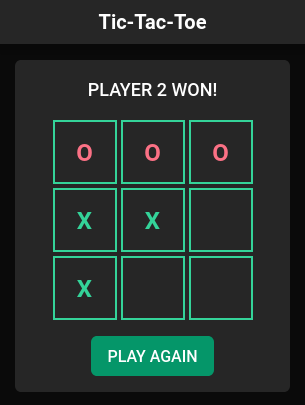

# Tic Tac Toe

---

## 📕 About

A simple Tic Tac Toe game made with React.

---

## ⚒️ Used Technologies

To develop this page, I used these technologies:

- React
- Typescript
- Tailwindcss
- Vite

---

## ✨ Features

- Responsivity
- Accessability
- Mobile-first design
- Typical Tic Tac Toe experience :D

---

## 🤝 Be a Contributor

Have any idea that can help boost the project, and want to share it? It's simple!

1. Clone/Fork the project
2. Modify what you want
3. Commit the changes
4. Open a Pull Request

---

## 🔓 License

This project is under license. Click [here](./LICENSE.md) for details.
